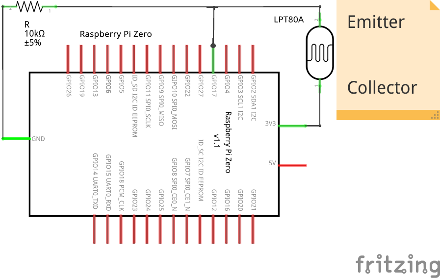

# PI POwer MONitor

LED blink dedection from smart meter with optical sensor (LPT80A) for LED  
Value output with 4-digit TM1637 display


Orange LED: ~590-605 nm  
[Osram LPT80A](https://www.conrad.at/de/p/osram-fototransistor-4-57-x-5-84-mm-1100-nm-40-lpt-80-a-153470.htm): 450-1100 nm (880 nm max sens.)


## circuit diagram



## compile

```bash
git clone https://github.com/mstroh76/pipomon.git
cd pipomon
wget https://raw.githubusercontent.com/GrazerComputerClub/TM1637Display/master/TM1637Display.cpp
wget https://raw.githubusercontent.com/GrazerComputerClub/TM1637Display/master/TM1637Display.h
g++ -Wall -o pipomon pipomon.c TM1637Display.cpp -lwiringPi
cp ./pipomon /usr/local/bin
pipomon
```


## install service

```bash
sudo cp pipomon.service /etc/systemd/system
sudo systemctl daemon-reload
sudo systemctl enable pipomon
```
